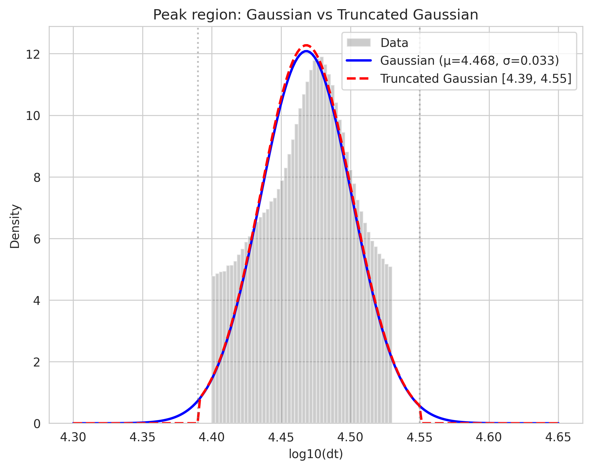
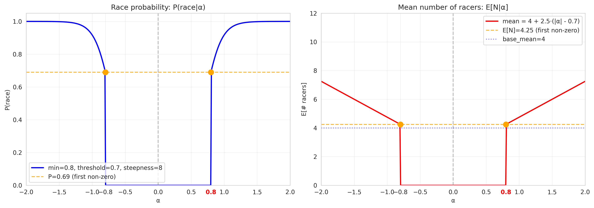
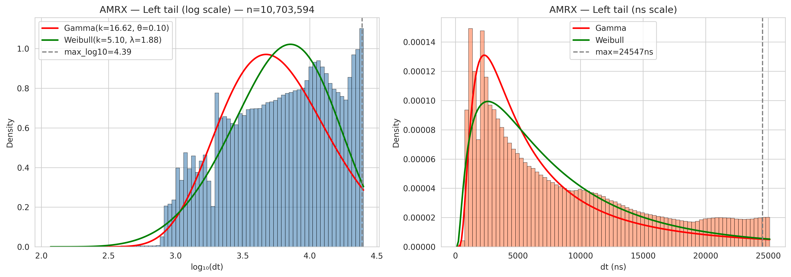
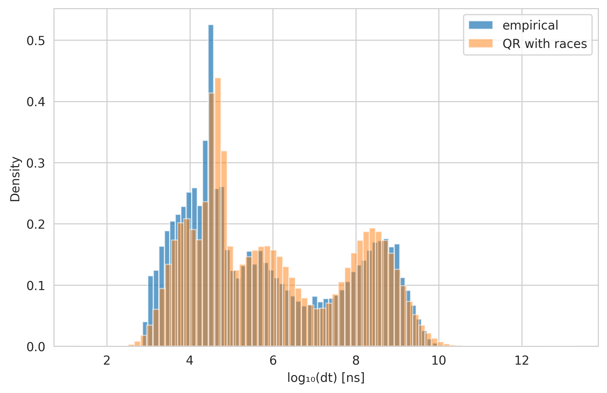
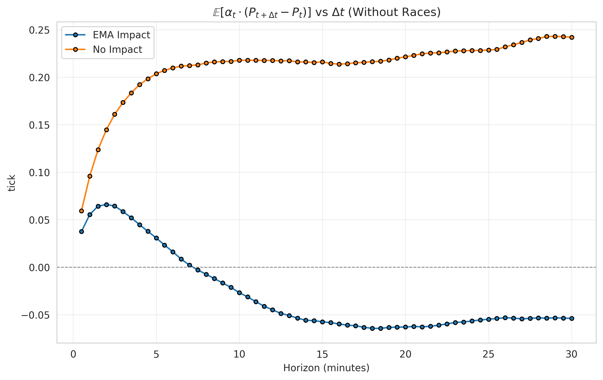
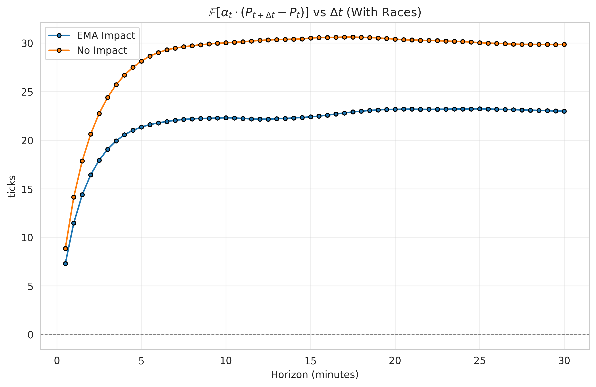

# 1. Round-Trip Time

We plot the distribution of inter-event times $\Delta t$ for multiple stocks in $\log_{10}$ space. Across all tickers, we observe a consistent mode around $\log_{10}(\Delta t) \approx 4.47$, corresponding to approximately **29 microseconds**.

Zooming into the peak region, the interval where density drops to 50% of the maximum is remarkably tight: $[4.39, 4.55]$ in $\log_{10}$ space, or roughly $[24\mu s, 35\mu s]$.

A plausible explanation for this is that it represents the **round-trip time**: the time for an order to reach the exchange, be processed by the matching engine, and propagate back to the public data feed. We denote this latency $\delta$ and model it as a random delay that every order is subject to.

Fitting a Gaussian to the peak region yields:

{width=80%}

| Parameter | Value |
|-----------|-------|
| $\mu$ | 4.471 |
| $\sigma$ | 0.040 |
| Bounds | $[4.39, 4.55]$ |

# 2. QR Inter-Event Times

Queue-reactive events are reactions to the current state of the order book. An agent observes the book, decides to act, and sends an order. Thus the inter-event time should be at least $\delta$ (round-trip) plus some reaction time. This justifies fitting only the peak region and beyond—excluding the fast left tail.

We fit a 3-component Gaussian Mixture Model (GMM) conditioned on imbalance and spread:

{width=100%}

# 3. Race Mechanism

The fast left tail of the $\Delta t$ distribution represents race events—bursts of aggressive orders in the direction of an exogenous signal $\alpha_t$. When $\alpha > 0$, racers target the ask side; when $\alpha < 0$, they target the bid side.

## 3.1 Race Triggering

Races are triggered with probability depending on $|\alpha|$:
$$P(\text{race}|\alpha) = \begin{cases} 0 & \text{if } |\alpha| < 0.8 \\ \frac{1}{1 + e^{-8(|\alpha| - 0.7)}} & \text{otherwise} \end{cases}$$

The number of racers follows a geometric distribution with mean scaling with $|\alpha|$:
$$\mathbb{E}[N|\alpha] = 4 + 2.5 \cdot (|\alpha| - 0.7)$$

{width=100%}

## 3.2 Race Composition

Race orders are composed of:

- **30% trades**: aggressive orders consuming liquidity
- **70% cancels**: defensive orders pulling liquidity before adverse selection

## 3.3 Inter-Arrival Times

We model the timing as:

- The first racer arrives at time $t_0 + \delta$
- Subsequent racers arrive with inter-arrival delays $\gamma_i$ drawn from the left tail
- The $i$-th racer arrives at: $t_0 + \delta + \sum_{j=1}^{i-1} \gamma_j$

We fit both Gamma and Weibull distributions to the left tail (log$_{10}(\Delta t) < 4.39$):

{width=100%}

Both provide good fits; Weibull is used by default.

With some tweaking we obtain this fit for the distribution of $\Delta t$:

{width=80%}

But we loose the fit of some other statistics in the process.

# 4. Alpha Predictivity

## 4.1 Biasing Mechanism

The bid and ask trade probabilities are biased by $\alpha$ and market impact:
$$P(\text{bid}) \propto e^{\text{impact}} \cdot e^{-\alpha}, \quad P(\text{ask}) \propto e^{-\text{impact}} \cdot e^{\alpha}$$

Thus $\alpha > 0$ increases ask trades (buys), pushing price up toward the signal. We measure predictivity via:
$$\mathbb{E}[\alpha_t \cdot (P_{t+\Delta t} - P_t)]$$

## 4.2 Without Races

{width=80%}

Without races, when we introduce impact it compensates the $\alpha$ bias—predictivity vanishes as the two effects cancel out.

## 4.3 With Races

{width=80%}

With races, impact dampens predictivity but it remains strong. The race mechanism consumes part of the signal, yet $\alpha$ retains significant predictive power over future price moves.
